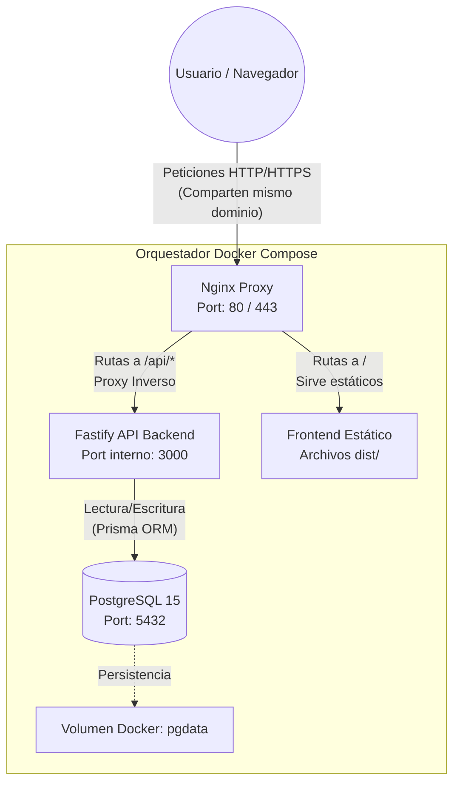

# Arquitectura del Backend - Fase 1 (Base y API)

Tras finalizar la primera fase, el proyecto ha dejado atrás la infraestructura temporal y delegada al frontend, para establecer un entorno de despliegue real preparado para producción.

## Diagrama de Orquestación

## Configuración y Puertos

Toda la aplicación está orquestada mediante un único archivo `docker-compose.yml` en la raíz.

*   **Nginx (Proxy):** Es la única puerta de entrada al sistema. Mapea los puertos `80` (HTTP) y `443` (HTTPS) de la máquina al contenedor. Se encarga de:
    *   Servir los archivos estáticos de la aplicación Vue (almacenados en `frontend/dist`).
    *   Interceptar cualquier petición que empiece por `/api/` y reenviarla al contenedor de Fastify.
*   **Fastify (Backend):** Corre internamente en el puerto `3000`. No se expone directamente a internet, sino que confía en Nginx para recibir tráfico. Esto aporta una capa extra de seguridad.
*   **PostgreSQL (Base de datos):** Utiliza el puerto por defecto `5432`. El servicio Fastify se comunica con él a través de la red interna de Docker usando su hostname (`db`). Los datos persisten en el volumen `pgdata`.

## Secuencia de Arranque (Boot Order)

El arranque está protegido mediante la instrucción `depends_on` de Docker Compose:

1.  **PostgreSQL (`db`)** arranca primero y empieza a inicializar el clúster y el volumen.
2.  **Fastify (`backend`)** arranca a continuación. Puesto que depende explícitamente del contenedor de base de datos (`depends_on: - db`), Docker espera para iniciar el API. En su arranque (`npm start`), instancia Prisma Client usando las variables de entorno.
3.  **Nginx (`proxy`)** es el último en arrancar (`depends_on: - backend`). Solo se levanta una vez que el backend está listo para recibir tráfico `/api/`.

*¿Por qué no de otra forma?*
Si el backend o Nginx intentaran iniciar sin las conexiones internas estables, el contenedor podría crashear y entrar en un bucle infinito de reinicios. 

## Buenas Prácticas Aplicadas

*   **Unificación y Eliminación de Código Muerto:** Hemos borrado la antigua carpeta `/database` (que contenía configuraciones manuales e intentos en Express sobrantes), centralizando todo en el `docker-compose.yml`.
*   **Aislamiento y Proxy Inverso:** En vez de configurar CORS complejos y gestionar descargas/estáticos desde Node.js, descargamos esa responsabilidad a **Nginx**. Nginx es experto en servir estáticos y además nos añade encabezados como `X-Real-IP` para poder implementar seguridad (rate limits) real más adelante.
*   **Esquema Descriptivo (Single Source of Truth):** El esquema `schema.prisma` define completamente toda nuestra lógica de metadatos de compartición, centralizando el diseño y delegando las migraciones a código controlado.
*   **Ejecución Concurrente en Desarrollo:** En desarrollo, el comando de inicio en la raíz (`npm run dev`) ahora usa `concurrently` para lanzar tanto Vite (Frontend) como Fastify (Backend) al mismo tiempo, en vez del operador `&&` que los corría secuencialmente bloqueando el servicio.
