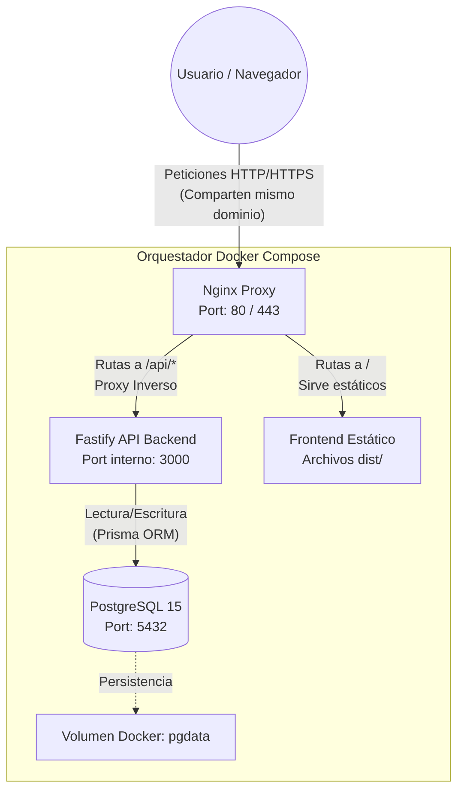

# Arquitectura del Backend - Fase 1 (Base y API)

Tras finalizar la primera fase, el proyecto ha dejado atrás la infraestructura temporal y delegada al frontend, para establecer un entorno de despliegue real preparado para producción.

## Diagrama de Orquestación

## Configuración y Puertos

Toda la aplicación está orquestada mediante un único archivo `docker-compose.yml` en la raíz.

*   **Nginx (Proxy):** Es la única puerta de entrada al sistema. Mapea los puertos `80` (HTTP) y `443` (HTTPS) de la máquina al contenedor. Se encarga de:
    *   Servir los archivos estáticos de la aplicación Vue (almacenados en `frontend/dist`).
    *   Interceptar cualquier petición que empiece por `/api/` y reenviarla al contenedor de Fastify.
*   **Fastify (Backend):** Corre internamente en el puerto `3000`. No se expone directamente a internet, sino que confía en Nginx para recibir tráfico. Esto aporta una capa extra de seguridad.
*   **PostgreSQL (Base de datos):** Utiliza el puerto por defecto `5432`. El servicio Fastify se comunica con él a través de la red interna de Docker usando su hostname (`db`). Los datos persisten en el volumen `pgdata`.

## Secuencia de Arranque (Boot Order)

El arranque está protegido mediante la instrucción `depends_on` de Docker Compose:

1.  **PostgreSQL (`db`)** arranca primero y empieza a inicializar el clúster y el volumen.
2.  **Fastify (`backend`)** arranca a continuación. Puesto que depende explícitamente del contenedor de base de datos (`depends_on: - db`), Docker espera para iniciar el API. En su arranque (`npm start`), instancia Prisma Client usando las variables de entorno.
3.  **Nginx (`proxy`)** es el último en arrancar (`depends_on: - backend`). Solo se levanta una vez que el backend está listo para recibir tráfico `/api/`.

*¿Por qué no de otra forma?*
Si el backend o Nginx intentaran iniciar sin las conexiones internas estables, el contenedor podría crashear y entrar en un bucle infinito de reinicios. 

## Buenas Prácticas Aplicadas

*   **Unificación y Eliminación de Código Muerto:** Hemos borrado la antigua carpeta `/database` (que contenía configuraciones manuales e intentos en Express sobrantes), centralizando todo en el `docker-compose.yml`.
*   **Aislamiento y Proxy Inverso:** En vez de configurar CORS complejos y gestionar descargas/estáticos desde Node.js, descargamos esa responsabilidad a **Nginx**. Nginx es experto en servir estáticos y además nos añade encabezados como `X-Real-IP` para poder implementar seguridad (rate limits) real más adelante.
*   **Esquema Descriptivo (Single Source of Truth):** El esquema `schema.prisma` define completamente toda nuestra lógica de metadatos de compartición, centralizando el diseño y delegando las migraciones a código controlado.
*   **Ejecución Concurrente en Desarrollo:** En desarrollo, el comando de inicio en la raíz (`npm run dev`) ahora usa `concurrently` para lanzar tanto Vite (Frontend) como Fastify (Backend) al mismo tiempo, en vez del operador `&&` que los corría secuencialmente bloqueando el servicio.

## ¿Por qué estas tecnologías? (El "Stack" Tecnológico Explicado)

Hola chiquis, aquí Fabri, he dejado estos ejemplos aquí abajo para entender cómo funciona exáctamente Framashare, tienen que imaginar que el backend es como un gran restaurante. Cada tecnología es un empleado o un área especializada que cumple un rol crítico para que los usuarios reciban sus archivos y datos de forma rápida y segura.

### 1. Docker y Docker Compose (El Edificio y sus Habitaciones Aisladas)
*   **Qué es:** Una plataforma de contenedores. En lugar de instalar programas directamente en el sistema operativo (donde pueden pelearse por diferentes versiones de librerías y romper otras aplicaciones), Docker envuelve cada pieza de software en su propia "caja" (contenedor) con todo lo que necesita para funcionar.
*   **Para qué lo usamos:** Para garantizar que el servidor de Framashare funcione exactamente igual en el portátil de un desarrollador, en un servidor de pruebas o en el servidor definitivo de producción. `Docker Compose` es el "arquitecto" que lee el plano (`docker-compose.yml`) y dice: *"Tú, base de datos, entra en esta habitación; tú, backend, en esta otra, y comunicaos exclusivamente por este pasillo privado"*.
*   **Alegoría:** Imagina que tienes un enorme edificio. En vez de poner la cocina (Base de datos), la recepción (Nginx) y el área de preparación (Fastify) mezcladas en un caos, Docker les asigna habitaciones insonorizadas con conductos de ventilación independientes. Si la cocina se incendia o colapsa, el incendio se queda encerrado en su contenedor sin derrumbar el resto del edificio.

### 2. Nginx (El Recepcionista y Guardia de Seguridad)
*   **Qué es:** Un servidor web de altísimo rendimiento configurado como "proxy inverso".
*   **Para qué lo usamos:** Es el primer y único punto de contacto expuesto a internet. Si un usuario pide la página web estática (la interfaz visual de botones), Nginx la saca de su archivador local rapidísimo y se la da de inmediato. Si el usuario pide algo dinámico (como *"dame los enlaces secretos de este PDF"*), Nginx actúa como proxy: intercepta el mensaje y se lo pasa por la puerta trasera al backend de Fastify.
*   **Alegoría:** Nginx es el recepcionista del restaurante. Cuando un cliente entra y pide el menú de papel (archivos estáticos), el recepcionista lo tiene a mano y se lo da al instante sin molestar a la cocina. Pero si el cliente pide "un bistec especial" (una llamada a la API), el recepcionista no cocina; anota la orden en un papel y se la pasa a los cocineros en la parte de atrás, esperando a que le devuelvan el plato para servírselo al cliente. Además, hace de guardia: bloquea intentos de ataque masivo antes siquiera de que lleguen a la cocina.

### 3. Fastify / Node.js (El Chef Ejecutivo)
*   **Qué es:** Un framework web ultrarrápido construido sobre Node.js para hacer APIs.
*   **Para qué lo usamos:** Es el cerebro de nuestras "reglas de negocio". Aquí programaremos instrucciones como: *"Comprueba si esta contraseña es correcta"*, *"Cuenta cuántas veces se ha abierto este documento y bloquea el acceso si superó el límite"*, o *"Procesa y sanea este archivo EPUB subido"*. Escogimos Fastify sobre el tradicional Express porque es sustancialmente más veloz, moderno y eficiente procesando miles de peticiones simultáneas.
*   **Alegoría:** Fastify es el chef principal del restaurante. Trabaja en la zona trasera (fuera de la vista de internet). Recibe la comanda que le ha pasado Nginx, piensa cómo ejecutarla, verifica si hay ingredientes en la despensa (la Base de datos), cocina la respuesta aplicando todas las reglas de negocio, y le devuelve el plato terminado al recepcionista para que lo envíe.

### 4. PostgreSQL (El Libro Mayor y la Caja Fuerte)
*   **Qué es:** Una de las bases de datos relacionales más robustas y respetadas del mundo, famosa por la fiabilidad e integridad de sus datos.
*   **Para qué lo usamos:** Para almacenar la "verdad absoluta" del proyecto: quiénes son los usuarios, las contraseñas encriptadas de los enlaces, las configuraciones de caducidad, y el límite exacto de aperturas de cada enlace. Su mayor ventaja son sus transacciones ACID; si dos personas intentan gastar la última "sesión de lectura disponible" en el mismo milisegundo, PostgreSQL garantiza matemáticamente que solo uno lo logre, sin que haya un error de sobrecupo.
*   **Alegoría:** Es la enorme caja fuerte blindada y el libro mayor inmutable del restaurante. El chef (Fastify) nunca confía en su memoria para saber si alguien pagó o si quedan ingredientes; siempre consulta rigurosamente el libro mayor. PostgreSQL es un contable perfecto que nunca pierde la cuenta, incluso si de repente hay un terremoto o un corte de luz a mitad de escribir una transacción.

### 5. Prisma ORM (El Traductor del Chef)
*   **Qué es:** Un Mapeador Objeto-Relacional (ORM). Una herramienta que permite a los desarrolladores comunicarse con la base de datos escribiendo código TypeScript puro en lugar de tener que redactar y mantener complejas sentencias SQL a mano.
*   **Para qué lo usamos:** Define exactamente la estructura de nuestras tablas y simplifica el cómo les hacemos preguntas. En vez de escribir `"SELECT * FROM User WHERE email = '...' LIMIT 1"`, escribiremos algo elegante y seguro contra inyecciones como `prisma.user.findUnique({ where: { email } })`.
*   **Alegoría:** Hablar directamente con el contable de la caja fuerte (PostgreSQL) exige usar un dialecto antiquísimo y sumamente estricto (SQL). Prisma es un brillante intérprete bilingüe. El Chef dice de forma natural *"Tráeme la ficha del usuario Carlos"*; Prisma lo traduce al lenguaje estricto de la caja fuerte, extrae los datos, se asegura de que tienen el formato correcto, y se los entrega al Chef listos para usar en su cocina.

### 6. Vue 3 + Vite (El Emplatado y el Comedor)
*   **Qué es:** Las herramientas detrás de nuestro Frontend, utilizadas para crear "Aplicaciones de una Sola Página" (SPA) interactivas.
*   **Para qué lo usamos:** Es absolutamente todo lo que el usuario ve, toca y lee en su navegador: el visor de PDFs con su buscador de texto, las preferencias de lectura del EPUB, los modales y el "Diseño de Sistema" de FramaShare.
*   **Alegoría:** Es el diseño de interiores, el confort de las sillas y el bellísimo emplatado final. Es posible que la cocina y la caja fuerte del restaurante estén en París (servidor remoto), pero el cliente disfruta la comida en una cómoda mesa interactiva que viaja instantáneamente hasta su pantalla (navegador). Vue 3 garantiza que cuando Nginx trae "la comida cruda en un paquete" (los datos en bruto tipo JSON), estos se dibujen y organicen de forma mágica frente a los ojos del comensal.
