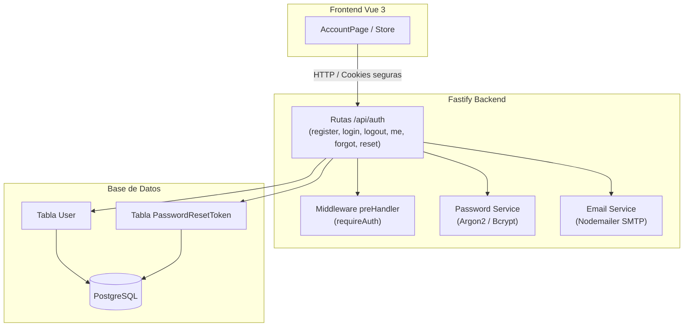

# Plan de Implementación - Fase 2: Autenticación y Cuentas de Usuario

Este documento detalla la hoja de ruta y la lista ordenada de tareas para implementar el sistema real de autenticación, gestión de usuarios, sesiones seguras y recuperación de contraseñas en FramaShare.

---

## 🎯 Objetivos de la Fase 2
- Reemplazar la simulación de cuentas en memoria del frontend por persistencia y autenticación real en el backend.
- Proteger contraseñas utilizando algoritmos criptográficos robustos (Argon2 / Bcrypt).
- Implementar sesiones seguras mediante cookies `httpOnly` o tokens JWT.
- Proveer flujo completo de recuperación de contraseña con tokens temporales de un solo uso y envío de correos vía SMTP.
- Proteger endpoints privados mediante middlewares/hooks de autenticación.

---

## 🗺️ Flujo de Trabajo y Arquitectura

---

## 📋 Lista Ordenada de Tareas

### Etapa 2.1: Dependencias y Variables de Entorno en Backend
- [x] Instalar librerías de autenticación y criptografía en `back/`:
  - Algoritmo de hash: `argon2` o `bcrypt` (+ `@types/bcrypt`).
  - Manejo de tokens y cookies: `@fastify/jwt` y `@fastify/cookie`.
  - Envío de correos: `nodemailer` y `@types/nodemailer`.
- [x] Crear archivo `back/.env` y plantilla `back/.env.example` con:
  - `DATABASE_URL` (conexión a PostgreSQL).
  - `JWT_SECRET` / `COOKIE_SECRET` (claves seguras para firma de tokens y cookies).
  - Configuración SMTP: `SMTP_HOST`, `SMTP_PORT`, `SMTP_USER`, `SMTP_PASS`, `FROM_EMAIL`.
  - Soporte para entorno local de pruebas de email (Ethereal o servicio local Mailpit).

### Etapa 2.2: Esquema de Base de Datos y Migración Prisma
- [x] Actualizar el modelo `User` en `back/prisma/schema.prisma`:
  - Añadir campo `name` (`String?`).
  - Añadir campo `role` (`String @default("author")`).
  - Añadir campo `quota` (`BigInt @default(1000000000)` para 1GB por defecto).
- [x] Crear modelo `PasswordResetToken` en `back/prisma/schema.prisma`:
  - `id` (UUID o CUID).
  - `tokenHash` (`String @unique`).
  - `userId` (referencia a `User.id` con eliminación en cascada).
  - `expiresAt` (`DateTime`).
  - `used` (`Boolean @default(false)`).
  - `createdAt` (`DateTime @default(now())`).
- [x] Ejecutar migración de Prisma:
  - `pnpm dlx prisma migrate dev --name add_auth_and_reset_tokens`.
  - Generar el cliente actualizado (`pnpm dlx prisma generate`).

### Etapa 2.3: Servicios Auxiliares de Backend
- [x] **Servicio de Contraseñas (`back/src/services/password.service.ts`)**:
  - `hashPassword(password: string): Promise<string>`
  - `verifyPassword(password: string, hash: string): Promise<boolean>`
- [x] **Servicio de Correo (`back/src/services/email.service.ts`)**:
  - Configurar transportador de Nodemailer.
  - Crear plantilla de correo para reseteo de contraseña con enlace único (`/reset-password?token=...`).
  - Función `sendPasswordResetEmail(to: string, resetLink: string): Promise<void>`.

### Etapa 2.4: Rutas y Controladores de Autenticación (`/api/auth`)
- [x] Crear módulo de rutas `back/src/routes/auth.routes.ts`:
  - `POST /api/auth/register`:
    - Validar email válido y contraseña de al menos 8 caracteres.
    - Comprobar que el email no exista previamente.
    - Hashear contraseña y persistir nuevo usuario.
    - Emitir cookie segura `httpOnly` o JWT con la sesión iniciada.
  - `POST /api/auth/login`:
    - Validar formato de entrada.
    - Buscar usuario por email y verificar hash de contraseña.
    - Emitir sesión en cookie `httpOnly` o token JWT.
  - `POST /api/auth/logout`:
    - Limpiar cookie de sesión en el cliente.
  - `GET /api/auth/me`:
    - Devolver perfil del usuario autenticado actual (id, email, nombre, rol, cuota).
  - `POST /api/auth/forgot-password`:
    - Verificar si el email existe (responder con mensaje genérico seguro para evitar enumeración de usuarios).
    - Generar token criptográfico con expiración corta (ej. 1 hora).
    - Guardar hash del token en `PasswordResetToken`.
    - Enviar correo con el enlace de reseteo.
  - `POST /api/auth/reset-password`:
    - Validar token recibido: no expirado y no usado previamente.
    - Hashear la nueva contraseña y actualizar el usuario.
    - Marcar el token como usado (`used = true`).
- [x] Registrar las rutas y plugins en `back/src/index.ts`.

### Etapa 2.5: Middleware de Protección de Rutas
- [x] Crear hook `preHandler` en Fastify (`back/src/middlewares/auth.middleware.ts`):
  - Verificar firma de la cookie o token en la petición.
  - Inyectar el usuario autenticado en `request.user`.
  - Retornar error `401 Unauthorized` si no está autenticado o la sesión expiró.

### Etapa 2.6: Integración con el Frontend (Vue 3)
- [x] Modificar `frontend/src/services/store.ts`:
  - Reemplazar array de usuarios simulados y función mock `signIn` por llamadas HTTP a `/api/auth/*`.
  - Crear métodos API: `apiRegister`, `apiLogin`, `apiLogout`, `apiGetMe`, `apiForgotPassword`, `apiResetPassword`.
  - Inicializar la sesión en el arranque comprobando `/api/auth/me`.
- [x] Conectar `frontend/src/views/AccountPage.vue`:
  - Adaptar los formularios de inicio de sesión, registro, recuperación y reseteo a las respuestas reales del backend.
  - Mostrar mensajes de error reales devueltos por la API (ej. credenciales inválidas, email duplicado, token caducado).

### Etapa 2.7: Pruebas y Verificación
- [x] Probar registro de usuario nuevo y confirmación en base de datos.
- [x] Probar login con credenciales correctas e incorrectas (verificar bloqueo y mensajes).
- [x] Probar persistencia de sesión al recargar la página en el navegador.
- [x] Probar cierre de sesión (logout) y verificación de eliminación de sesión.
- [x] Probar flujo completo de recuperación: solicitud de reseteo, generación de token, cambio de contraseña e intento con token ya usado o caducado.

