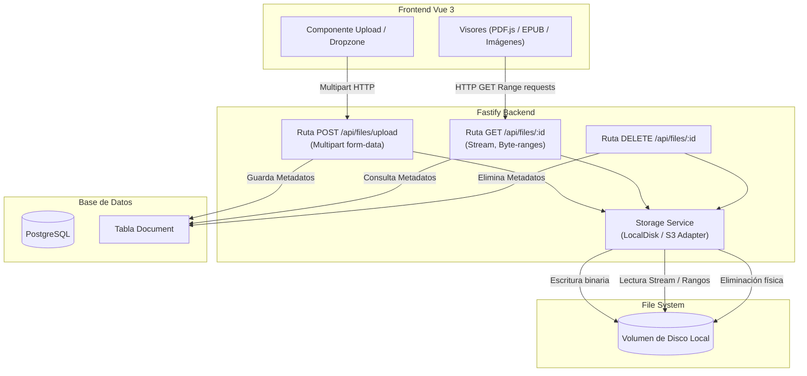

# Plan de Implementación - Fase 3: Almacenamiento y Gestión de Archivos

Este documento detalla la hoja de ruta y la lista ordenada de tareas para implementar el almacenamiento real de archivos, la carga (upload) y el servicio de archivos binarios desde el backend en FramaShare.

---

## 🎯 Objetivos de la Fase 3
- Reemplazar el guardado local temporal en memoria (navegador) por subidas al servidor vía API.
- Implementar el sistema de almacenamiento de archivos en el disco del servidor (volumen local privado), diseñado con un patrón adaptador para facilitar la integración futura con S3 o similares.
- Habilitar la eliminación física de archivos del almacenamiento cuando se borran lógicamente del sistema o caduca su retención.
- Servir los archivos binarios (PDFs, EPUBs, imágenes) desde el backend.
- Soportar peticiones `byte-range` (Rango de bytes) para la transferencia eficiente y visualización progresiva de PDFs en el navegador sin necesidad de descargar el archivo completo de una vez.

---

## 🗺️ Flujo de Trabajo y Arquitectura

---

## 📋 Lista Ordenada de Tareas

### Etapa 3.1: Dependencias en Backend
- [x] Instalar plugin para procesar peticiones multipart en Fastify: `@fastify/multipart`.
- [x] Configurar variables de entorno relacionadas con archivos en `back/.env`:
  - `STORAGE_PATH` (ruta del directorio privado donde se guardarán los archivos en disco, ej. `./uploads`).
  - `MAX_FILE_SIZE` (límite máximo de tamaño de subida permitido en bytes).

### Etapa 3.2: Esquema de Base de Datos y Migración Prisma
- [x] Crear o actualizar el modelo `Document` en `back/prisma/schema.prisma`:
  - `id` (UUID o CUID).
  - `title` (Nombre original del archivo o título definido).
  - `filename` o `storageKey` (Nombre único generado en disco para evitar colisiones).
  - `mimeType` (Tipo de contenido, ej. `application/pdf`).
  - `size` (Tamaño en bytes).
  - `ownerId` (Referencia a `User.id`).
  - `createdAt` y `updatedAt`.
- [x] Ejecutar migración de Prisma:
  - `pnpm dlx prisma migrate dev --name init_document_storage`.
  - Generar el cliente de Prisma actualizado.

### Etapa 3.3: Servicios de Almacenamiento de Backend
- [x] **Crear Servicio de Almacenamiento (`back/src/services/storage.service.ts`)**:
  - Implementar patrón que facilite el cambio entre almacenamiento local y la nube (S3).
  - `saveFile(stream, metadata): Promise<string>`: Escribe el stream a disco y retorna la ruta o clave de almacenamiento (`storageKey`).
  - `getFileStream(storageKey: string, range?: { start: number, end: number }): Promise<ReadableStream>`: Lee el archivo desde disco soportando opcionalmente rangos.
  - `getFileStats(storageKey: string): Promise<Stats>`: Obtiene metadatos como el tamaño total real del archivo en disco.
  - `deleteFile(storageKey: string): Promise<void>`: Borra físicamente el archivo del disco.

### Etapa 3.4: Rutas y Controladores de Archivos (`/api/files`)
- [x] Registrar `@fastify/multipart` en la instancia de la aplicación `back/src/index.ts`.
- [x] Crear módulo de rutas `back/src/routes/files.routes.ts`:
  - `POST /api/files/upload`:
    - Procesar el stream de la subida.
    - Validar tipos MIME permitidos y el límite de tamaño.
    - Delegar la escritura a `StorageService.saveFile()`.
    - Persistir un nuevo registro `Document` en la base de datos con los metadatos.
    - Retornar el `id` y los detalles básicos del documento.
  - `GET /api/files/:id`:
    - Buscar el registro `Document` en base de datos.
    - (Nota de acceso: provisionalmente verificar que el usuario sea el dueño).
    - Parsear el header `Range` en caso de peticiones progresivas de PDFs.
    - Retornar headers HTTP apropiados (`Content-Type`, `Content-Length`, `Accept-Ranges: bytes`, `Content-Range` si aplica).
    - Establecer el stream de respuesta conectándolo con `StorageService.getFileStream()`.
    - Retornar status HTTP `206 Partial Content` (si es con rango) o `200 OK`.
  - `DELETE /api/files/:id`:
    - Buscar el `Document` y verificar que el usuario actual es el propietario.
    - Llamar a `StorageService.deleteFile()` para borrar el archivo físico del disco.
    - Borrar el registro `Document` de la base de datos.
    - Retornar confirmación `204 No Content`.

### Etapa 3.5: Integración con el Frontend (Vue 3)
- [ ] Actualizar el sistema de subida en la UI (`frontend/src/services/store.ts` o componentes de Upload):
  - Cambiar el almacenamiento in-memory/blob de local por el envío real a través de `FormData` a `POST /api/files/upload`.
- [ ] Actualizar visores del Frontend (PDF.js, EPUB, Componente de Imágenes):
  - Adaptar la prop de fuente/src para apuntar al endpoint real `GET /api/files/:id`.
  - Para PDF.js, asegurarse de no descargar el blob entero previamente en JavaScript, sino pasarle directamente la URL remota para que se encargue internamente de realizar las llamadas de rango (byte-ranges).
- [ ] Actualizar la eliminación de archivos:
  - Invocar al endpoint `DELETE /api/files/:id` y, en caso de éxito, actualizar el estado (store) quitándolo de la vista.

### Etapa 3.6: Pruebas y Verificación
- [ ] Subir múltiples formatos (PDF, EPUB, Imágenes) y confirmar su escritura correcta en el directorio de servidor (ej. `back/uploads/`).
- [ ] Confirmar que el tamaño (`size`) y tipo (`mimeType`) se mapean correctamente a la base de datos.
- [ ] Inspeccionar peticiones de red del visor de PDFs en las herramientas de desarrollo del navegador para verificar que se lanzan requests con headers `Range: bytes=X-Y` y el servidor responde con status `206`.
- [ ] Eliminar un documento y confirmar manualmente que se destruyó el archivo en el sistema de archivos del servidor (para evitar fugas de espacio en disco).
